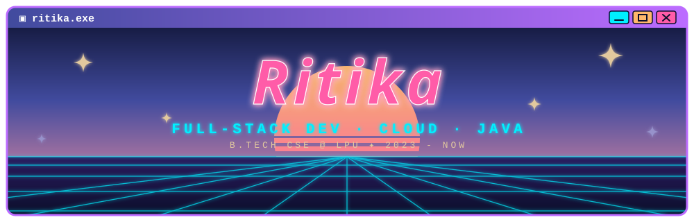

<div align="center">



<br/>

<a href="https://github.com/ritiiika"></a>

<br/>

<a href="https://www.linkedin.com/in/ritika-4a344b297"></a>
<a href="mailto:ritikaaaa2567@gmail.com"></a>
<a href="https://github.com/ritiiika"></a>


</div>


## ✦ About Me

<table>
<tr>
<td width="62%" valign="top">

- 🎓 **B.Tech CSE** student at **Lovely Professional University** (2023 – present)
- 💻 **Web Development Intern** at **INTERNPE** — React.js, REST APIs, Git
- ☁️ Earned **135+ Google Cloud Skill Badges** and solved **100+ problems** on LeetCode / HackerRank / GFG
- 🧩 Built a **full-stack social media platform**, a **serverless file system on AWS**, and an **AI investment research platform**
- 🎯 Currently exploring **backend engineering (Java / Spring Boot)**, **cloud**, and **DevOps**

</td>
<td width="38%" align="center" valign="middle">

<!-- ✏️ Replace with your own picture: put it in /assets and change the path below -->


</td>
</tr>
</table>


## ✦ Tech Stack

**Languages**<br/>


**Frontend**<br/>


**Backend**<br/>


**Databases**<br/>


**Testing**<br/>


**Cloud & DevOps**<br/>


**Core CS**<br/>


## ✦ Projects

| Project | What I built | Stack | Repo |
|---|---|---|---|
| 🤖 **AI Investment Research Platform** <br/><sub>Jun – Jul 2026</sub> | AI-powered investment research app that generates insights through the OpenRouter API using Gemini 2.5 Flash | `React.js` `TypeScript` `Node.js` `Express.js` | [🔗 Repo](https://github.com/ritiiika/REPO-NAME) |
| ☁️ **Cloud Serverless File System** <br/><sub>Mar – Apr 2026</sub> | Serverless file storage system on AWS with API-driven access and monitoring | `AWS Lambda` `S3` `API Gateway` `IAM` `CloudWatch` `Docker` | [🔗 Repo](https://github.com/ritiiika/REPO-NAME) |
| 💬 **Full-Stack Social Media Platform** <br/><sub>Feb – Mar 2026</sub> | Social media app with JWT authentication and REST APIs, tested with Postman | `React.js` `Spring Boot` `Java` `JWT` `MySQL` | [🔗 Repo](https://github.com/ritiiika/REPO-NAME) |


## ✦ Experience

```text
[Jul 2026 – Aug 2026]  Web Development Intern  @ INTERNPE
                       > HTML5 · CSS3 · JavaScript · React.js · REST APIs · Git

[Jan 2026 – Mar 2026]  Java & Java Full-Stack Development Training @ Cipher School
```


## ✦ Achievements


**📜 Certifications**

- HackerRank — Java (Basic)
- Oracle Certified Data Platform Foundation Associate
- Oracle Cloud Infrastructure AI Foundations
- NPTEL — Privacy and Security in Online Social Media


## ✦ Stats

<div align="center">


</div>


<div align="center">

### ✦ let's connect ✦

<a href="https://www.linkedin.com/in/ritika-4a344b297"></a>
<a href="mailto:ritikaaaa2567@gmail.com"></a>

<sub>✦ made with neon &amp; caffeine ✦ thanks for stopping by ✦</sub>

</div>
